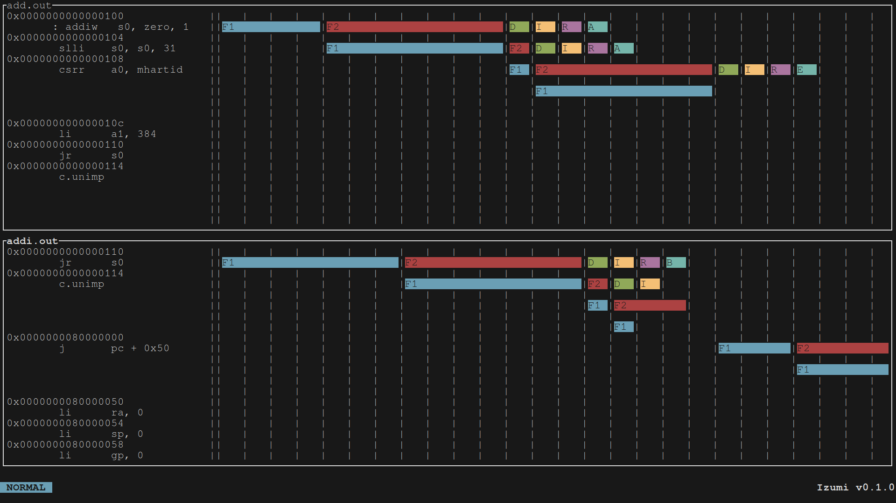

# Izumi

Izumi is an instruction pipeline visualizer for Onikiri2-Kanata format based on [shioyadan/Konata](https://github.com/shioyadan/Konata).

> [!Note]
> The tool is still under development and may not work properly with full
> features of the format.

## Supported features

- Instruction

    Only support for file identificator
- Stage
- Line on left
- End of stage (for multiple cycle stages/stalling the pipeline)
- End of instruction

## Requirements

- `ncurses`
- `meson` (build only) *[version >=1.2.0]*
- `ninja` (build only, can be replaced by other meson backends)
- `python3` (build only)

## Building (and installing)

Building with `meson` is recommended:

```bash
meson setup build
cd build
meson compile
meson install
```
> [!IMPORTANT]
> meson needs to be available as root for `meson install`

But, if the classic `make` sequence is hard-wired in your brain, you can:

```bash
./configure
make
make install
```

You can also use `nix` (flakes recommended):
```bash
nix run github:theOfficeCat/Izumi
```
## Usage

```bash
$ make run # If you want to test before installing
$ izumi (path/to/file)
```

> [!IMPORTANT]
> In some cases an `AddressSanitizer:DEADLYSIGNAL` error can be raised randomly when starting the program. Just kill the program and try again. If it persists, please report it.

> [!NOTE]
> Some example files supported are on `examples` directory. These are generated on the RISC-V core [Sargantana](https://github.com/bsc-loca/core_tile/).

### Commands

| Command | Description |
|---------|-------------|
| `:q`    | Quit        |
| `:quit` | Quit        |
| `:open (path)`    | Open a file on the current panel |
| `:o (path)`    | Open a file on the current panel |
| `:findpc 0x(address)` | Search and go to the first appearance of the address |
| `:findinst (instruction)` | Search and go to the first appearance of the instruction |
| `:next` | Next appearance of the last search |
| `:prev` | Previous appearance of the last search |
| `:newpanel` | Create a new panel |
| `:panelcmd j` | Select next panel |
| `:panelcmd k` | Select previous panel |
| `:closepanel` | Close focused panel |
| `:c` | Close focused panel |
| `:closepanel (index)` | Close requested panel |
| `:c (index)` | Close requested panel |
| `:closeallpanels` | Close all panels |
| `:ca` | Close all panels |
| `:set bar_offset (amount)` | Set offset of the vertical bar (not persistent) |
| `:set stage_width (amount)` | Set width of the stage on the pipeline visualizer (not persistent) |
| `:set color (element) (foreground color) (background color) <bold>` | Set color of the element (not persistent) |
| `:panelsync` | Sync movement of all the panels |
| `:paneldesync` | Desync movement of all the panels |

> [!NOTE]
> The `:set` commands are not persistent, so you will need to set them again on the next run.

> [!IMPORTANT]
> Information for the `:set color` command
>
> The `<element>` option can be one of the following:
> - `text` Sets the color of the text shown on the screen
> - `commands` Sets the color of the commands shown on the bottom of the screen when typing one
> - `box` Sets the color of the box around the window
> - `status` Sets the color of the status of the application at the bar on the bottom of the screen
> - `stage1` Sets the color of the first stage of the pipeline
> - `stage2` Sets the color of the second stage of the pipeline
> - `stage3` Sets the color of the third stage of the pipeline
> - `stage4` Sets the color of the fourth stage of the pipeline
> - `stage5` Sets the color of the fifth stage of the pipeline
> - `stage6` Sets the color of the sixth stage of the pipeline
> If there are more than six stages, the color of the seventh and following stages will return to the color of the first stage and repeat the cycle.
>
> It requires the color to be one of the list:
> - `black`
> - `white`
> - `red`
> - `green`
> - `yellow`
> - `blue`
> - `magenta`
> - `cyan`
> The `<bold>` option is optional. If you want to set a color to bold, just add `bold` at the end of the command.

### Keybindings

| Key | Description |
|-----|-------------|
| `n` | Next appearance of the last search |
| `N` | Previous appearance of the last search |
| `j` | Move down |
| `KEY_DOWN` | Move down |
| `k` | Move up |
| `KEY_UP` | Move up |

## Screenshot



I know it's not the best looking tool, but it's a start (now it has colors :D).

---


