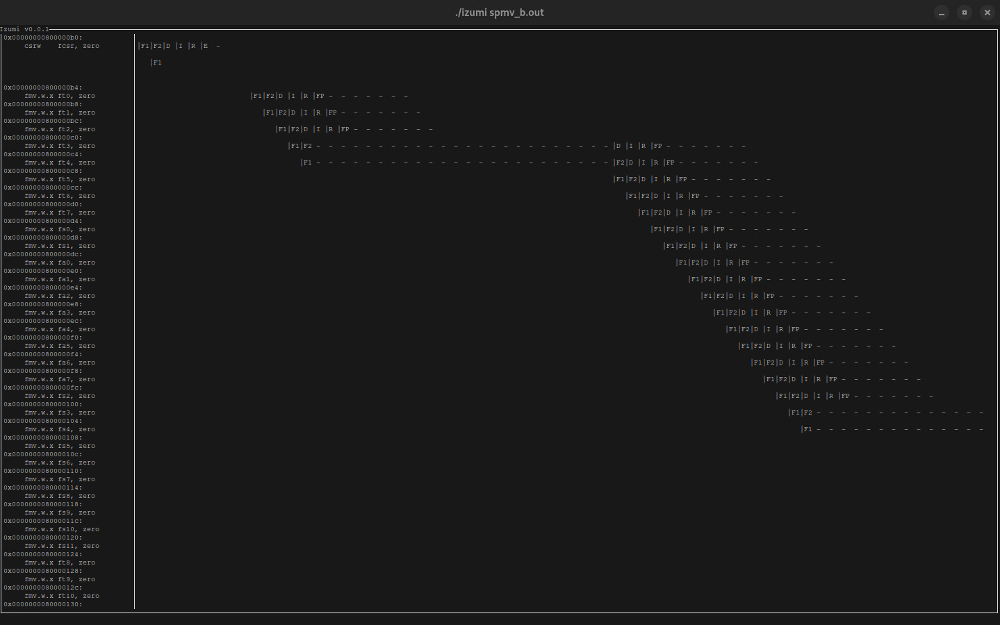

# Izumi

Izumi is an instruction pipeline visualizer for Onikiri2-Kanata format based on [shioyadan/Konata](https://github.com/shioyadan/Konata).

> [!Note]
> The tool is still under development and may not work properly with full
> features of the format.

## Supported features

- Instruction

    Only support for file identificator
- Stage
- Line on left
- End of stage (for multiple cycle stages/stalling the pipeline)
- End of instruction

## Usage

```bash
$ make
$ ./izumi <input_file> [-p]
```

- `input_file`: The input file in Onikiri2-Kanata format
- `-p`: Print the data of the pipeline to the terminal before visualizing with
the ncurses frontend

## Screenshot



I know it's not the best looking tool, but it's a start (I will add colours eventually).


